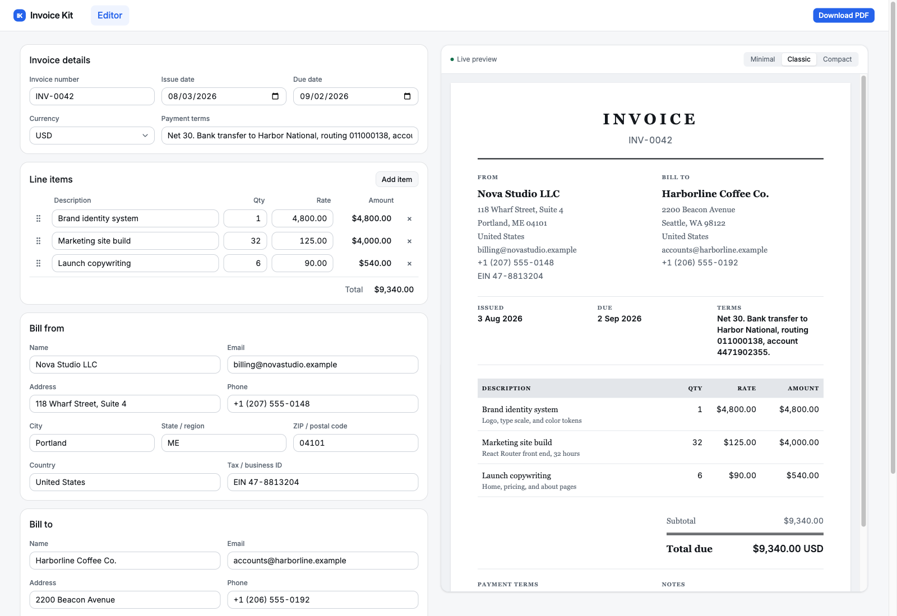

# Invoice Kit

A fast, minimal invoice builder that runs on Cloudflare Workers. Fill in the
form, watch the invoice render next to it, and download the PDF. No account, no
sign-up wall, nothing stored on a server.



## What works today

- **Invoice editor** with bill from, bill to, invoice details, payment terms,
  and notes
- **Line items** you can add, edit, remove, and drag to reorder, totalled as you
  type
- **Live preview** that updates with every keystroke
- **Three templates** (Minimal, Classic, Compact) for both the preview and the PDF
- **PDF download** rendered by Cloudflare Browser Rendering, no account required

Accounts, saved invoices, status tracking, and uploads are next. See the
[Roadmap](#roadmap) for what is coming.

**Your data stays in your browser.** The invoice you are editing lives in
`sessionStorage`, so it survives a refresh and disappears when you close the tab.
The only thing sent to the server is the draft you post to the PDF endpoint,
which is rendered and streamed straight back. Nothing is written to a database
or a bucket.

## Requirements

| | |
| --- | --- |
| Node.js | 22.22.0 or newer |
| pnpm | 11.17.0 (`corepack enable` picks it up from `package.json`) |
| Cloudflare account | Free tier is fine. Needed for PDF download, including in local development |

The editor, the preview, and the templates all run offline. Only the PDF button
needs Cloudflare, because Browser Rendering has no local implementation and the
dev server points that binding at the real service.

## Run it locally

```bash
git clone https://github.com/denniscampos/invoice-kit.git
cd invoice-kit
pnpm install
pnpm dev
```

The app is at http://localhost:5173. If that port is taken, Vite picks the next
free one and prints the URL it chose.

There is no `.env` to copy and no third-party API key to obtain. Every setting
lives in `wrangler.json`.

### Enabling the PDF download in development

`wrangler.json` declares the Browser Rendering binding with `"remote": true`, so
your dev server calls the real service on your own Cloudflare account. Log in
once:

```bash
npx wrangler login
```

Then click **Download PDF** in the editor. Two things worth knowing:

- **Renders in development are real renders** and they draw down your account
  quota. On the free tier that is roughly ten minutes of browser time per day,
  with a new browser allowed every twenty seconds. Check the
  [Browser Rendering limits](https://developers.cloudflare.com/browser-rendering/platform/limits/)
  for current numbers.
- If you skip the login, everything except the PDF button still works. The
  button will fail rather than the page.

The render endpoint is `POST /invoice/pdf`. It takes an invoice draft as JSON,
refuses anything larger than 128 KB or anything that fails validation, and
answers with the PDF. It reads no session and touches no storage, so it can be
called directly:

```bash
curl -X POST http://localhost:5173/invoice/pdf \
  -H 'content-type: application/json' \
  --data @invoice.json \
  -o invoice.pdf
```

## Commands

| Command | What it does |
| --- | --- |
| `pnpm dev` | Dev server with hot module replacement |
| `pnpm build` | Production build into `build/` |
| `pnpm preview` | Build, then serve the production build locally |
| `pnpm typecheck` | Regenerate binding types, then run `tsc -b` |
| `pnpm test` | Unit tests once (Vitest) |
| `pnpm test:watch` | Unit tests in watch mode |
| `pnpm cf-typegen` | Regenerate `worker-configuration.d.ts` from `wrangler.json` |
| `pnpm check` | Typecheck, build, and a deploy dry run |
| `pnpm deploy` | Deploy to Cloudflare Workers |

Run `pnpm cf-typegen` after any change to the bindings in `wrangler.json`.

## Host it yourself on Cloudflare

The whole app is one Worker. There is no database, no bucket, and no secret to
set, so a deploy is a single command once you are logged in.

### 1. Get a Cloudflare account

[Sign up](https://dash.cloudflare.com/sign-up) if you do not have one. The free
plan covers this app, including Browser Rendering within its daily limits. Your
Worker gets a free `*.workers.dev` subdomain.

### 2. Log in with Wrangler

```bash
npx wrangler login
```

For CI or a headless machine, set `CLOUDFLARE_API_TOKEN` instead, using a token
with the **Workers Scripts: Edit** and **Browser Rendering: Edit** permissions.

### 3. Pick your Worker name

Worker names are unique per account, so open `wrangler.json` and change `name`
if you want something other than `invoice-kit`. That name becomes your URL:

```jsonc
{
  "name": "invoice-kit",
  "main": "./workers/app.ts",
  "browser": { "binding": "BROWSER", "remote": true }
}
```

The `browser` binding is what turns the invoice HTML into a PDF. Leave it in
place; without it the download endpoint has nothing to call. The leftover
`VALUE_FROM_CLOUDFLARE` var from the starter template is unused and safe to
delete.

### 4. Check, then deploy

```bash
pnpm check
pnpm deploy
```

`pnpm check` typechecks, builds, and runs a deploy dry run, so it catches a bad
binding before anything ships. `pnpm deploy` uploads the Worker and prints the
live URL.

### 5. Verify the deploy

Open the URL, fill in an invoice, and click **Download PDF**. If the page loads
but the PDF fails, the binding is the thing to look at: confirm Browser
Rendering is enabled on your account and that you have not spent the day's quota.

Observability is on in `wrangler.json`, so logs and traces show up under your
Worker in the Cloudflare dashboard. For a live tail:

```bash
npx wrangler tail
```

### Deploying a preview first

To upload a version without sending traffic to it:

```bash
npx wrangler versions upload
```

Verify the preview URL, then promote it, either all at once or gradually:

```bash
npx wrangler versions deploy
```

## Roadmap

Invoice Kit is built one feature at a time. Everything above the line below is
live today; everything under it is planned. `blueprint/build-plan.md` is the
authoritative list and tracks progress as each item ships.

**Shipped**

1. Invoice editor
2. Line items
3. Live invoice preview
4. Template selection
5. PDF generation

Those five are the whole free path: build an invoice and download it without
signing up. Nothing is stored on the server.

**Next: the account path**

Everything below needs an account, and an account is what unlocks storage. The
free path stays free and stays account-free.

| | Feature | What it adds |
| --- | --- | --- |
| 6 | Accounts and auth | Sign up, sign in, sign out, and protected routes (Better Auth on D1) |
| 7 | Invoice persistence | Save invoices to D1, scoped to the signed-in user |
| 8 | Draft handoff | Carry an in-progress anonymous invoice through sign-up into the new account |
| 9 | Invoice list | Browse saved invoices by client, number, total, due date, and status |
| 10 | Status tracking | Mark invoices draft, sent, or paid, with overdue derived from the due date |
| 11 | Invoice detail view | Open a saved invoice to view, edit, download, or change its status |
| 12 | Delete and void | Delete a draft, or void a sent invoice while keeping the record |
| 13 | Logo upload | Attach a logo stored in R2 |
| 14 | Previous invoice upload | Store invoice files created outside the app |

**Hardening and shipping**

| | Feature | What it adds |
| --- | --- | --- |
| 15 | Rate limiting | Cloudflare rate limiting on the account-free PDF endpoint |
| 16 | Self-hosted setup | A documented clone-to-running path against your own D1 and R2 |
| 17 | Deployment readiness | D1, R2, and Browser Rendering bindings verified end to end |

**Later**

Custom fields, invoice-level tax and discount controls, invoice duplication,
saved clients to reuse across invoices, and a settings page for default
currency, payment terms, sender details, and invoice numbering.

## Project structure

```
app/
  routes/
    editor.tsx           the editor at /
    invoice.pdf.tsx      POST /invoice/pdf, the render endpoint
  components/invoice/    form cards, preview pane, template switcher
    templates/           Minimal, Classic, and Compact invoice templates
  lib/                   draft parsing, money math, formatting, print document
  types/invoice.ts       the invoice draft shape
workers/app.ts           the Worker entry, kept thin
wrangler.json            Worker config and bindings
blueprint/               planning docs, specs, and history
```

Money is stored as integer minor units (cents) everywhere, never floats. Dates
are ISO `YYYY-MM-DD` strings.

## Tech stack

React Router 8 (SSR, framework mode), React 19, TypeScript, Tailwind CSS v4,
shadcn/ui, Vite 8, and Cloudflare Workers with Browser Rendering. Tests run on
Vitest.

## Contributing

This project is built one feature at a time behind review gates. `AGENTS.md`
describes the workflow, `blueprint/build-plan.md` is the roadmap, and
`blueprint/context/coding-standards.md` holds the conventions. Read those before
opening a pull request.
